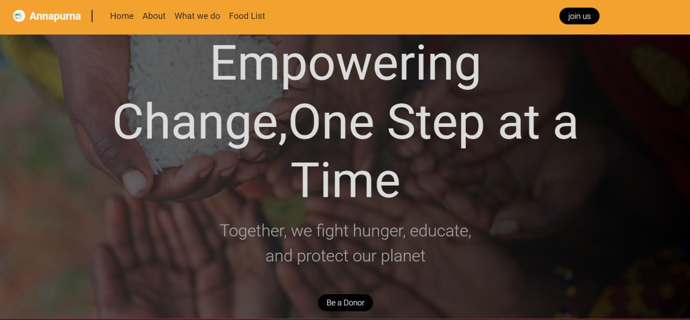
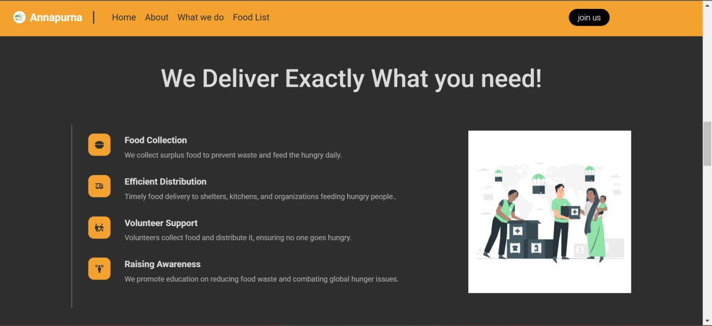
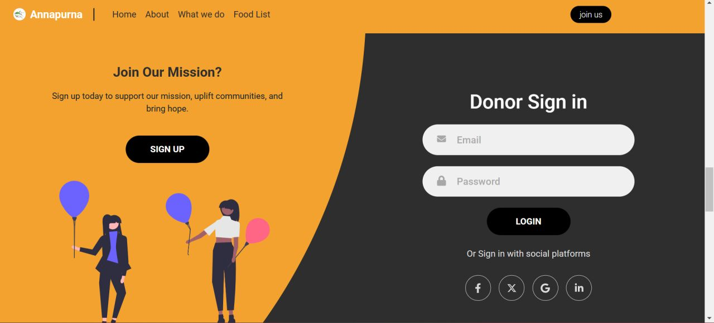
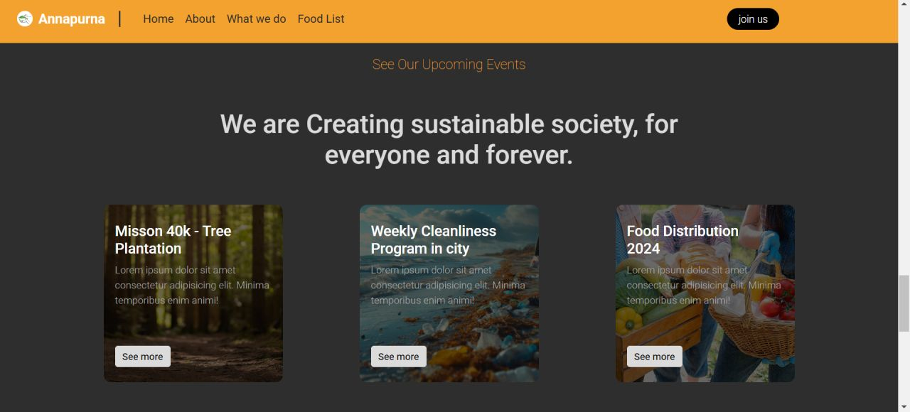
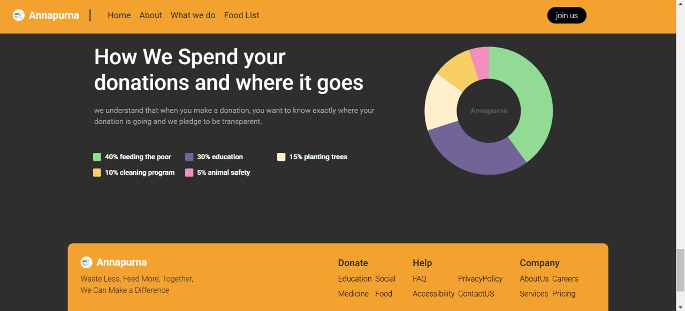
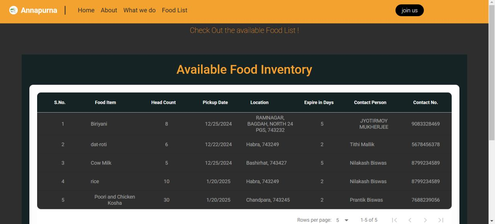
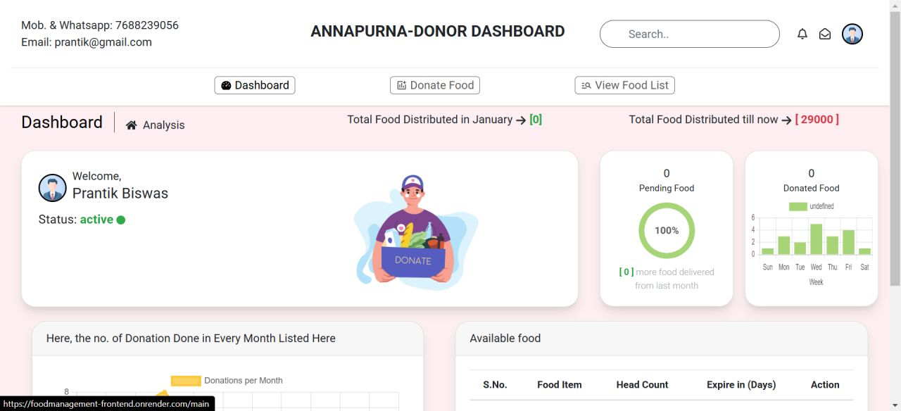
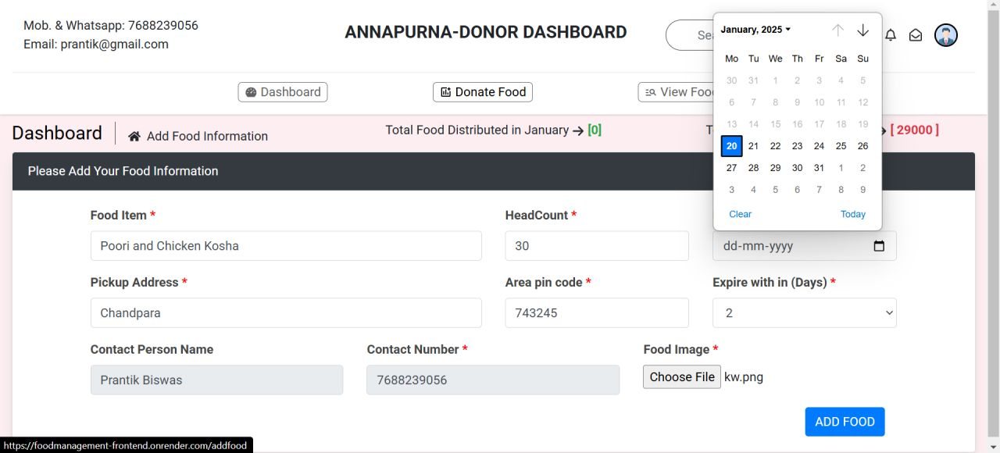
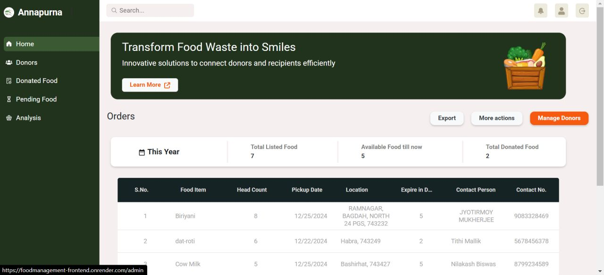
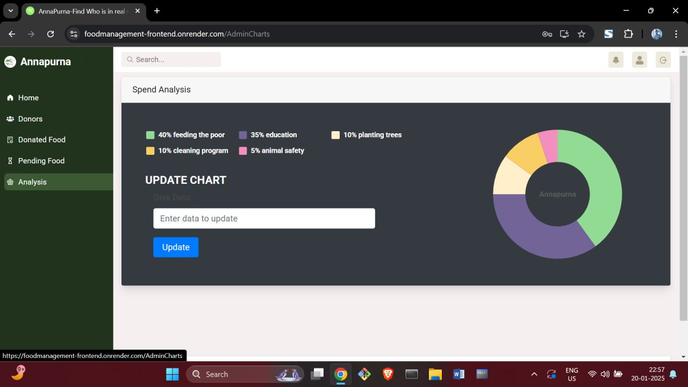

# 🌍 NGO Food Management System 🍱

## 🚀 Overview
The **NGO Food Management System** is a full-stack MERN application designed to streamline food donation and distribution processes for NGOs.

It helps manage donors, track food inventory, monitor distribution, and reduce food wastage through a structured and transparent system.

This platform bridges the gap between **food donors and NGOs**, ensuring efficient utilization of surplus food.

---

## ✨ Features

### 🔐 Authentication & Authorization
- **Secure Access:** Login and registration using JSON Web Tokens (JWT).
- **Security:** Password encryption with `bcrypt`.
- **RBAC:** Role-Based Access Control (Admin / Donor).

### 📦 Donation Management
- **Submissions:** Donors can submit detailed food donation forms.
- **Media:** Upload food images using `Multer`.
- **Validation:** Server-side and client-side validation for accurate data entry.

### 📊 Admin Dashboard
- **Centralized Control:** Manage all incoming donations.
- **Tracking:** Real-time food inventory tracking.
- **Analytics:** Monitor donor activities and view system-wide analytics.

### 📈 Inventory Tracking
- **Wastage Reduction:** Real-time tracking of available food.
- **Records:** Maintain structured digital records of all transactions.

### 📋 Data Visualization
- **Insights:** Graphical representation of data using `Chart.js`.
- **Trends:** Easy monitoring of donation trends over time.

### 🔎 Data Tables
- **Efficiency:** Built-in search, filter, and sort functionality.
- **UI:** Clean and user-friendly data presentation.

---

## 🛠️ Tech Stack

**Frontend:**
- React.js
- Bootstrap
- Axios
- SweetAlert2
- Chart.js
- React Data Table

**Backend:**
- Node.js
- Express.js

**Database:**
- MongoDB
- Mongoose

**Security:**
- JSON Web Token (JWT)
- bcrypt

**Other Tools:**
- Multer (File Upload)
- Dotenv (Environment Variables)

---

## 🛠️ Installation

### Prerequisites
- Node.js (v16 or higher)
- MongoDB (Local or Atlas)
- Git

---

### 🔧 Setup Steps

1. **Clone the Repository**
   ```bash
   git clone <your-repo-url>
   cd foodmanagement-main

2. **Setup Backend**
   ```bash
   cd server
   npm install
   # Create a .env file and add your credentials
   npm start

3. **Setup Frontend**
   ```bash
   cd client
   npm install
   npm start

4. **Access the App**
Open your browser and navigate to: `http://localhost:3000`


### 📖 Usage
1. **Register or login as a donor or admin.**

2. **Donors: Submit food donation details and upload images.**

3. **Admins: Review donations, update inventory, and analyze trends via the dashboard.**


## 🌐 Deployment
The app is live on Render:  
[foodmanagement-frontend.onrender.com](https://foodmanagement-frontend.onrender.com/) 🎉


To deploy your own instance:
1. Push the code to a GitHub repository.
2. Connect to Render and configure environment variables.
3. Deploy the backend and frontend separately (or as a monorepo if preferred).

## 📸 Screenshots













## 🤝 Contributing
Love to have you onboard! 🚢
1. Fork the repository.
2. Create a new branch: `git checkout -b feature/your-feature`.
3. Commit changes: `git commit -m "Add your feature"`.
4. Push to the branch: `git push origin feature/your-feature`.
5. Submit a pull request. 🎉

## 📜 License
This project is licensed under the MIT License.

## 📬 Contact
Reach out to [Prantik](https://github.com/Prantik009) or explore the live app at [Annapurna](https://foodmanagement-frontend.onrender.com/).
